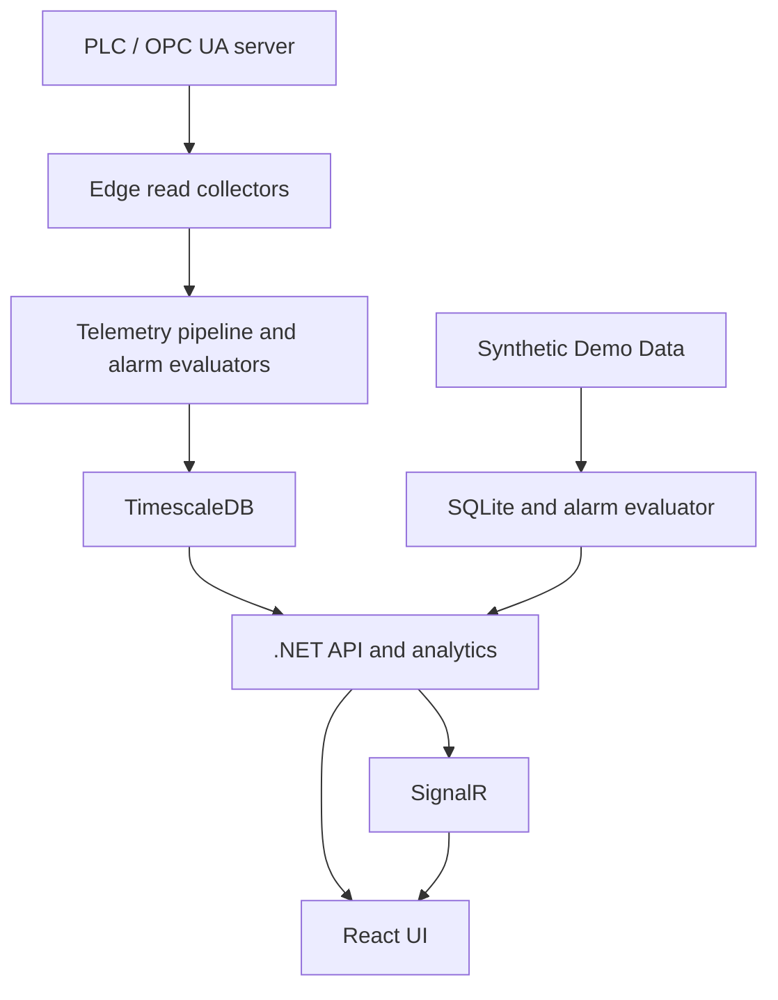
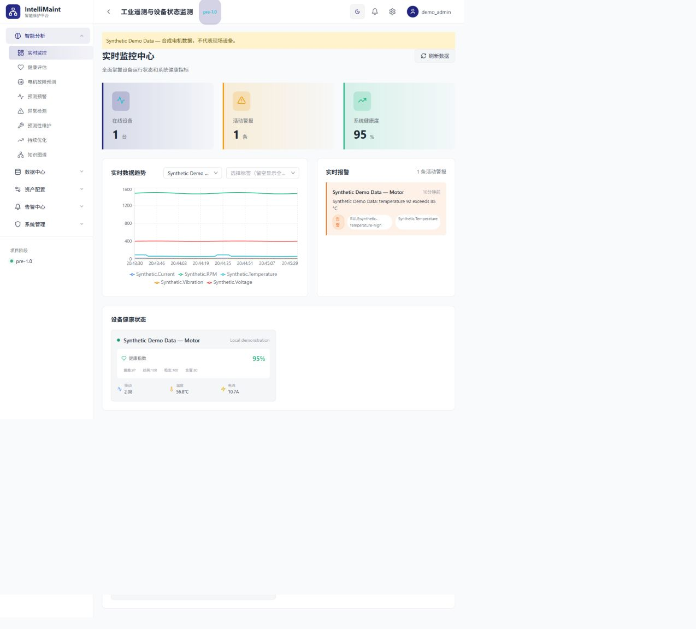

# IntelliMaint Pro

Industrial telemetry and condition monitoring with a .NET 8 API, React UI, and read-oriented Edge collectors.
工业遥测与设备状态监测；可使用合成数据在没有 PLC 的电脑上体验。

[](https://github.com/leopark123/intellimaint-pro/actions/workflows/ci.yml)
[](LICENSE)
[](docs/RELEASE_CHECKLIST.md)

## Overview

IntelliMaint Pro collects time-series signals, displays current values and history, evaluates alarms,
and calculates heuristic equipment-health scores. It is intended for developers and automation
engineers evaluating condition-monitoring workflows. It is **pre-1.0**: no production reliability,
predictive accuracy, warning horizon or maintenance ROI is claimed.

## Key Features

- Authenticated REST API and SignalR telemetry updates with a React/TypeScript dashboard.
- Device/tag configuration, telemetry queries, historical trend charts and alarm acknowledgement.
- Threshold, rate-of-change, offline and volatility alarm evaluation in the Edge pipeline.
- Health-score calculations, stored health history and FFT spectrum calculation.
- SQLite local operation and an opt-in, hardware-free synthetic motor demo.

**Experimental:** motor fault heuristics, trend extrapolation and remaining-life estimates have no
field accuracy validation. Anomaly/model/knowledge-graph/work-order pages contain labelled synthetic
examples. **Partial:** OPC UA and Allen-Bradley collectors, TimescaleDB provider validation and
store-and-forward integration. See the [feature matrix](docs/FEATURE_MATRIX.md).

## Architecture



The standalone Edge writes to the database. Its proposed HTTP store-and-forward path is incomplete.
The local demo runs a synthetic source inside the API process. [Architecture details](docs/architecture.md).

## Supported Industrial Interfaces

| Protocol | Status | Tested Environment | Notes |
|---|---|---|---|
| OPC UA | Partial | Source/build review; no server interoperability run in this audit | Session, subscription, polling fallback and reconnect code; secure certificate provisioning required |
| Allen-Bradley / EtherNet/IP via libplctag | Partial | Source/build review; no real controller run | CIP tag reads; ControlLogix/CompactLogix options exist, compatibility must be verified per controller |
| Synthetic motor source | Implemented | SQLite API integration tests and local HTTP smoke | No PLC/server; not a protocol simulator or a claim of hardware compatibility |
| Modbus, OPC DA, MQTT publishing | Planned | None | Contracts/options do not constitute implementations |

See [protocol configuration and behavior](docs/protocols.md). Collectors are disabled in the shipped
Edge configuration. PLC writes and machine control are outside this demo.

## Screenshots

The screenshot below was captured from the actual local demo on 2026-09-16.
All displayed equipment readings are **Synthetic Demo Data**, not customer or field results.



## Quick Start

Prerequisites: **.NET 8 SDK** (8.0.4xx), **Node.js 22.12+** and Git. No database server or PLC is needed.
Run these commands from a terminal:

```sh
git clone https://github.com/leopark123/intellimaint-pro.git
cd intellimaint-pro
node tools/demo/init.mjs
dotnet restore IntelliMaint.sln
npm ci --prefix intellimaint-ui
node tools/demo/run.mjs
```

Keep the API running. Open a second terminal in the repository root:

```sh
node tools/demo/run.mjs ui
```

Open [the UI](http://localhost:3000). Use `ADMIN_USERNAME` and the randomly generated `ADMIN_PASSWORD`
from your local `.env`. There is no shared default password. The API is at
[localhost:5000](http://localhost:5000); [Swagger](http://localhost:5000/swagger) is available only in Development.
Stop each process with Ctrl+C. The helper preserves an existing `.env` rather than overwriting credentials.

## Hardware-Free Demo

The **Synthetic Demo Data** device produces temperature, vibration, RPM, current and voltage every second.
It seeds five minutes of history and exceeds a demo temperature threshold during each one-minute cycle.
Visit Dashboard, Data Explorer, Alarm Management and Health Assessment. Health history is saved by the
normal background service after its initial delay; the single-device score API is immediately available.

With the API running, verify the path:

```sh
node tools/demo/smoke.mjs
```

Data is synthetic and is not a customer dataset. FFT/fault accuracy, OPC UA interoperability and PLC
timing are not tested by this demo. [Demo details](tools/demo/README.md).

An optional root `compose.yaml` builds the same SQLite demo. Its container execution must be verified
on a Docker host; see the [readiness report](docs/OSS_READINESS_REPORT.md) for the actual validation boundary.
After generating `.env` with the helper above:

```sh
docker compose config --quiet
docker compose up --build
```

The container UI uses [localhost:8080](http://localhost:8080), the API port remains 5000. This loopback-only
Development stack is for evaluation. The separate TimescaleDB stack is documented in [installation](docs/installation.md).

## Development Setup

| Area | Entry point | Notes |
|---|---|---|
| Backend | `src/Host.Api` | .NET 8; explicit JWT and first-run credentials |
| Frontend | `intellimaint-ui` | `npm ci`, `npm run dev`; Vite proxies API/SignalR to port 5000 |
| Database | `src/Infrastructure/Sqlite` | Automatic schema migrations; demo file is local and ignored |
| Edge Worker | `src/Host.Edge` | Separate process; TimescaleDB connection and explicit protocol configuration required |

```sh
dotnet build IntelliMaint.sln -c Release
dotnet test IntelliMaint.sln -c Release
npm run lint --prefix intellimaint-ui
npm test --prefix intellimaint-ui
npm run build --prefix intellimaint-ui
```

See [development](docs/development.md) and [testing](docs/testing.md). The test suite does not require
KEPServerEX, RSLinx, private certificates, a company network or PLC hardware.

## Configuration

Use [.env.example](.env.example) as the variable reference. .NET itself does not load `.env`:
the demo helper loads it, Docker Compose interpolates it, or you must export variables explicitly.
See [configuration](docs/configuration.md) for exact names and precedence. Keep secrets and certificate
private keys out of Git. `DATABASE_URL` is not a supported configuration key.

## Security

Read [SECURITY.md](SECURITY.md) before connecting to a plant network. Older revisions contained public
credentials and a captured login response; deployments using those values must rotate them.
Changes to PLC writes, safety interlocks, emergency stops or protection logic require human review
and onsite validation before deployment.

## Documentation

- [Documentation index](docs/README.md) and [troubleshooting](docs/troubleshooting.md)
- [Initial OSS audit](docs/OSS_AUDIT.md), [feature matrix](docs/FEATURE_MATRIX.md), [readiness report](docs/OSS_READINESS_REPORT.md)
- [Release checklist](docs/RELEASE_CHECKLIST.md) and [changelog](CHANGELOG.md)

## Roadmap

- Reproducible OPC UA and Allen-Bradley interoperability fixtures.
- Clean TimescaleDB migration/runtime validation and provider parity.
- Complete and test offline upload semantics.
- Labelled-data evaluation of diagnosis and prediction algorithms.
- Production readiness checks, durable token revocation and improved frontend test coverage.

## Contributing

See [CONTRIBUTING.md](CONTRIBUTING.md), [Code of Conduct](CODE_OF_CONDUCT.md) and
[AGENTS.md](AGENTS.md). Reproducible bugs, protocol test fixtures and documentation corrections are welcome.

## License

[MIT](LICENSE), consistent with the original README declaration. Third-party dependencies retain their
own licenses. Maintainers must verify contribution ownership and dependency notices before a public release.
